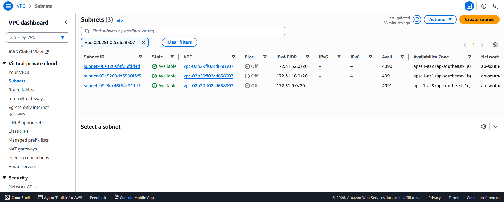
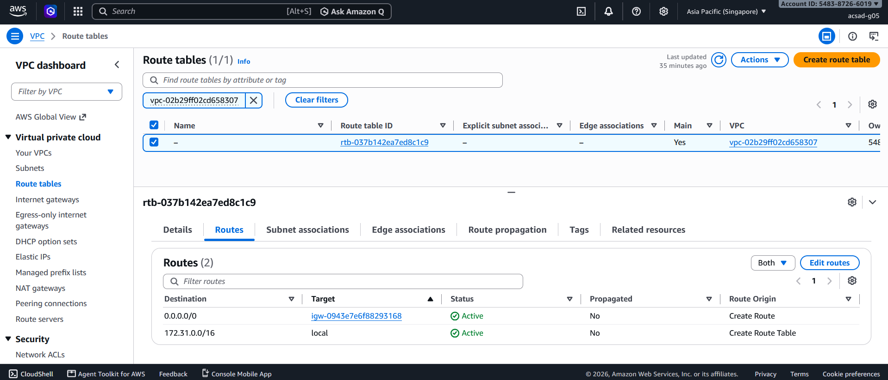
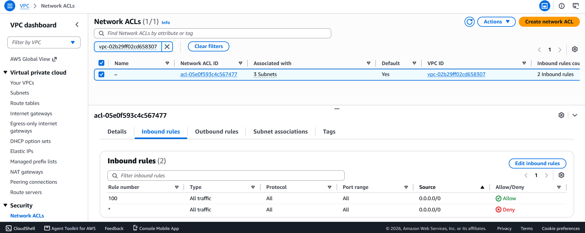
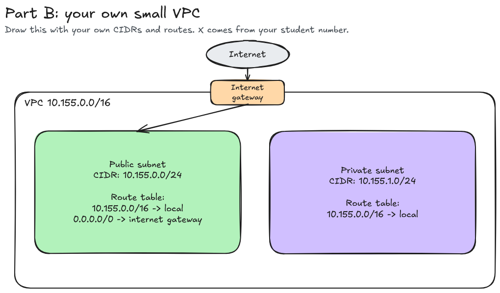

# Assignment 2 Submission

## About me

- GitHub username: stratterium
- Section: IV-ACSAD
- IAM user name that I signed in with: acsad-g05
- X: 155

---

## Part A. Explore

### A1. The VPC

Default VPC IPv4 CIDR:

172.31.0.0/16

Number of addresses in that CIDR:

65,536. A /16 leaves 16 free bits, and 2^16 = 65,536.

### A2. The subnets

| Availability Zone | IPv4 CIDR |
| --- | --- |
| ap-southeast-1a | 172.31.32.0/20 |
| ap-southeast-1b | 172.31.16.0/20 |
| ap-southeast-1c | 172.31.0.0/20 |

### A3. Available addresses

Available IPv4 addresses in each subnet:

ap-southeast-1a: 4,090. ap-southeast-1b: 4,091. ap-southeast-1c: 4,091.

Why is the number lower than 4,096?

A /20 holds 2^12 = 4,096 addresses, but AWS reserves five in every subnet and never gives them to instances. They are the first address (the network address), the second (the VPC router), the third (the Amazon DNS server), the fourth (kept for future use), and the last (the network broadcast address, which is reserved even though a VPC does not support broadcast). A subnet with nothing running in it therefore shows 4,096 - 5 = 4,091 available addresses, which is exactly what ap-southeast-1b and ap-southeast-1c show.

What uses the missing address in the subnet with the lowest number?

The lowest is ap-southeast-1a, at 4,090, one below the other two. The extra missing address is held by a network interface, the virtual network card of a resource. The EC2 Network Interfaces page shows exactly one interface in that subnet. It is attached to a running EC2 instance, and its private address, 172.31.37.42, falls inside the subnet's range of 172.31.32.0/20. So the count works out as 4,096 - 5 reserved - 1 in use = 4,090. The other two subnets have no interfaces, which is why they show the full 4,091.

### A4. The route table

| Destination | Target |
| --- | --- |
| 172.31.0.0/16 | local |
| 0.0.0.0/0 | igw-... |

### A5. Public or private

Are the default subnets public or private? Which route proves it?

Public. The route 0.0.0.0/0 has an internet gateway (igw-...) as its target, and that route is what makes a subnet public. The name of a subnet or the public IP of an instance does not decide it. The public IP only lets a particular instance use the path that the route provides, which is why our Lab 2 instances could be opened from a browser. The instance we found in A3 shows the difference: its network interface has no public IPv4 address, so even though it sits in a public subnet, it cannot be reached directly from the internet.

### A6. The internet gateway

State of the internet gateway:

Attached

What happens to the default subnets if the gateway is detached?

The route 0.0.0.0/0 would point at a gateway that is no longer attached, so it becomes a blackhole and internet traffic in both directions stops. The subnets would lose their path to the internet and behave like private subnets. Traffic inside the VPC would keep working, because the local route does not depend on the gateway. (In practice AWS refuses to detach a gateway while instances still have public IP addresses mapped, so those addresses would have to be released first.)

### A7. NAT gateways

Number of NAT gateways:

0

Can a server in a new private subnet download updates? Why?

No. A private subnet has no route to the internet gateway, and the only other way out is a NAT gateway, which this VPC does not have. The server could not be reached from the internet, but it also could not start a connection to download anything. To fix that, we would create a NAT gateway in a public subnet and add a route 0.0.0.0/0 to it in the private subnet's route table, at an hourly cost. One more detail: a new subnet that is not explicitly associated with a route table falls back to the main route table, and the route table shown in A4 includes the internet gateway route, so the new subnet would first have to be associated with a local-only route table to be private at all.

### A8. The network ACL

| Rule number | Source | Allow or Deny |
| --- | --- | --- |
| 100 | 0.0.0.0/0 | Allow |
| * | 0.0.0.0/0 | Deny |

How is a network ACL different from a security group?

A network ACL protects a whole subnet, while a security group protects one resource such as an instance. A network ACL is stateless, so reply traffic needs its own rule in the opposite direction, and it supports deny rules, which are checked in order of rule number from lowest to highest until one matches. A security group is stateful, has allow rules only, and evaluates all its rules together. This network ACL allows all inbound traffic through rule 100 and only falls to the final deny rule if nothing matches, so in this VPC the real filtering is done by security groups.

### A9. The default security group

Inbound rule (type and source):

All traffic, with the source being sg-0c5b6d4081cf0a534 / default, which is the default security group itself.

Which resources can send traffic to an instance that uses it?

Only resources that are members of the same default security group. The group has no rule for any address range, so traffic from the internet, and from resources in other security groups, is dropped. This is why in Lab 2 we created our own web security group with a rule that allows HTTP on port 80 from 0.0.0.0/0.

---

## Part B. Prepare

### B1. Plan two subnets

- Public subnet CIDR: 10.155.0.0/24
- Private subnet CIDR: 10.155.1.0/24

### B2. Route tables

Route table of the public subnet:

| Destination | Target |
| --- | --- |
| 10.155.0.0/16 | local |
| 0.0.0.0/0 | internet gateway |

Route table of the private subnet:

| Destination | Target |
| --- | --- |
| 10.155.0.0/16 | local |

### B3. My VPC diagram

Tool used (Excalidraw, draw.io, Lucidchart, or paper):

Excalidraw

### B4. Predict a change

Can you still open the web page from your laptop? Why?

No. A web page needs a path in both directions, and without the route 0.0.0.0/0 the instance has no route for any destination outside the VPC range. Even if the request from the laptop reached the instance, its reply would have nowhere to go. The public IP address and the open port 80 in the security group are not enough, because the missing piece is the route.

Can the instance still reach another instance in the VPC? Why?

Yes. The local route for the VPC range is still in the route table, and it cannot be removed. It connects every subnet in the VPC, so traffic between instances never needs the internet gateway. The other instance's security group must still allow the traffic, since routing only provides a path and the firewall decides what may use it.

### B5. Place a database

Which subnet gets the database? Why?

The private subnet, 10.155.1.0/24. Its route table has no route to the internet gateway, so nobody on the internet can reach the database directly. The servers in the public subnet can still reach it through the local route, and its security group can be limited to accept connections only from the application's security group on the database port. If the database ever needed updates from the internet, a NAT gateway would let it start connections outward without accepting any inbound ones.

### B6. My question about VPCs

What is your question, and what made you think of it?

If one internet gateway serves a whole VPC, and the VPC spans several Availability Zones, is the gateway a single point of failure? I thought of it because the diagram shows a single gateway attached to subnets that would sit in different zones, while the README stresses spreading subnets across zones for resilience.
