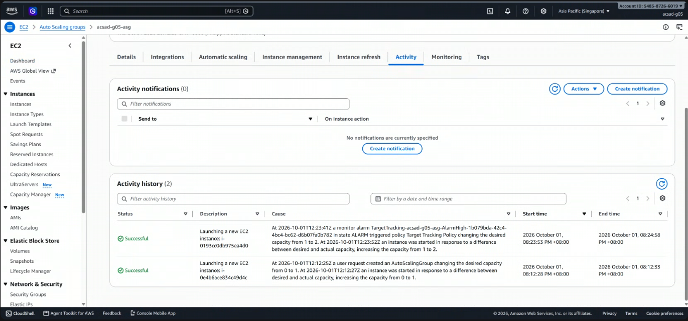
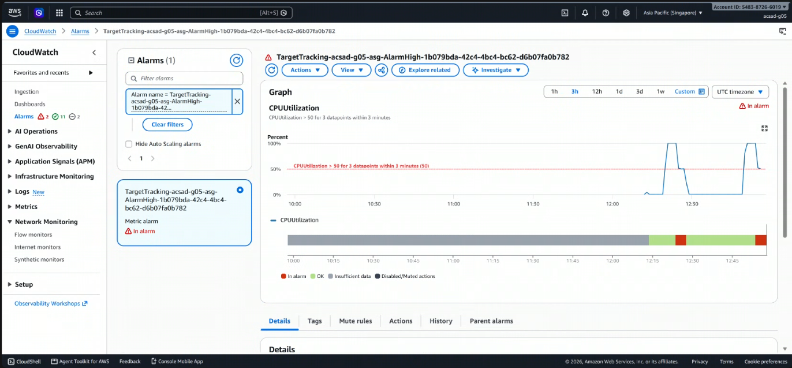

# Lab 2 Submission

Group 5 | CPU target value: 50

## Instance Tracking
**First Instance**
- Instance ID: i-0e4b6ace834c49d4c
- Availability Zone: ap-southeast-1b

**Second Instance**
- Instance ID: i-0193cc0db975ea4d0
- Availability Zone: ap-southeast-1a

## Proof (Screenshots)
1. **Activity History:** Add a screenshot showing the Auto Scaling group's Activity history when the second instance launched.

   

2. **CloudWatch Alarm (In alarm state):** Add a screenshot of the target tracking alarm in the "In alarm" state.

   

## Questions

1. Why did the group stop at 2 instances?

   The maximum capacity of the group was set to 2 in Step 3, and the maximum is a hard ceiling on what the scaling policy may request. The target tracking policy keeps working out how many instances it would like from the CPU reading, but that number is clamped between the minimum (1) and the maximum (2). Even if average CPU had stayed above our 50 percent target after the second instance joined, the group could not have grown past two. The ceiling is deliberate. Without it, a runaway load or a badly chosen policy could keep launching instances with no natural stopping point, and the bill would be the first sign of trouble.

2. Why did terminating an instance by hand not remove the cost?

   An Auto Scaling group holds a desired capacity, and its job is to keep the number of healthy running instances equal to that number. When we terminated an instance ourselves, the group saw the count fall below the desired capacity, treated the loss as a failure, and launched a replacement, which is why the Activity tab showed a new launch. Terminating an instance changes what exists, but only changing the group's desired capacity, or deleting the group, changes what the group wants. We paid for the same number of instances before and after, with only the instance ID different. The same mechanism gives the group its self-healing, and it means cost is controlled at the group level, not the instance level.

3. Why is the target value set to your assigned value (e.g., 30-85 percent) instead of 99 percent?

   Our target is 50 percent. A target tracking policy works like a thermostat, and a target near 99 percent would only trigger once the server is already saturated. A new instance is not useful the moment it is requested: it has to launch, boot, run the user-data script, pass its checks, and finish the 60 second warmup. During that delay the existing instance keeps serving at full load, so requests slow down or fail before help arrives. A target of 50 percent leaves headroom to absorb a spike while capacity is being added. The value is also a cost tradeoff, since a low target scales out early and keeps more instances running, while a high one saves money but spends the safety margin. Giving each team a different value also lets the class compare how the target changes when scale-out fires.

4. What did the automatic cutoff protect us from?

   Scale-in waits about fifteen minutes of low CPU before removing an instance, which is longer than the class period, and a group that is never deleted keeps its instances running and billing. Because the group also replaces any instance that is terminated (see question 2), a student who terminated instances and walked away would find them come back. The cutoff ends the group for us, so forgotten resources on the shared account cannot pile up charges overnight. It also limits how long a public, unauthenticated /burn endpoint stays reachable on the internet.

5. What changes when a load balancer sits in front of the group?

   Clients would use one stable DNS name instead of copying each instance's public IP, and the balancer would spread requests across the instances. That would change this experiment: the CPU load would be shared instead of concentrated on the instance we hit with /burn, so average CPU would fall on its own after scale-out. The group could also use the balancer's health checks instead of only EC2 status checks, so it could replace an instance whose application had stopped responding even while the virtual machine was still up. Instances would register and deregister automatically as the group grows and shrinks, so users never address a server that is going away. Finally, the instances could sit in private subnets, reachable only through the balancer, which shrinks the attack surface.
